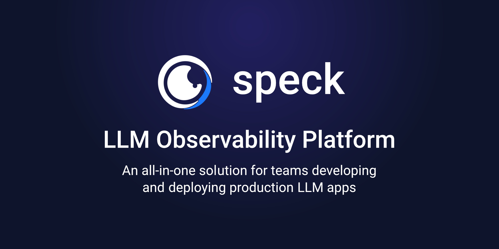

<p align="center">
    
</p>
<p align="center">
    <a href="https://discord.com/invite/frnaYYaKj3">
        
    </a>
    <a href="https://github.com/speckai/speck">
        
    </a>
</p>

🎊 _We recently launched our python package: `pip install python-speck`_

---

<b>Speck</b> is an LLM debugging and observability platform. Prompt engineer, A/B test, and track your production LLM app metrics in one place.

### Features

- Unified model input/output format
- LLM and app log tracking

---

## Getting Started

### Python

```shell
pip install python-speck
```

---

## Background

Monitoring LLM apps in production isn't easy.

---

## Development

### Installing Latest Version

```shell
pip3 install git+https://github.com/speckai/speck.git#subdirectory=src/python
```
